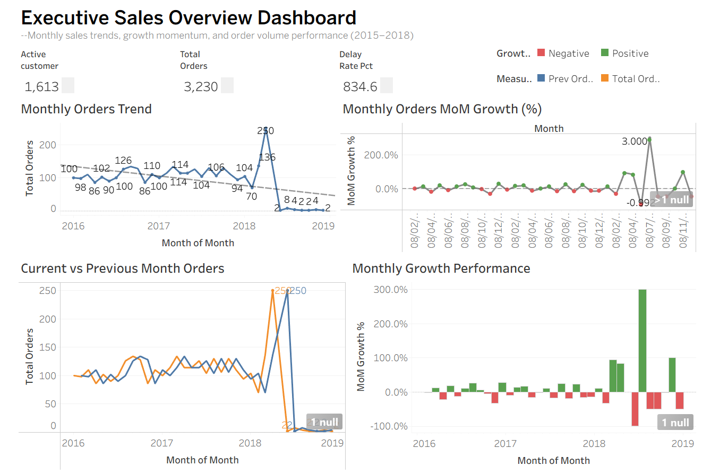
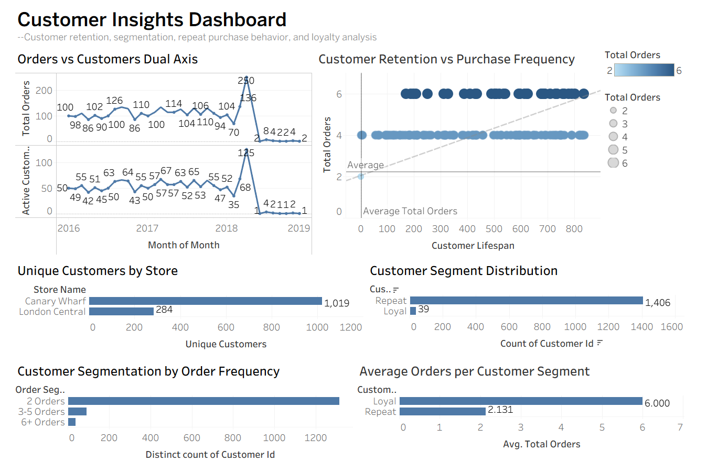
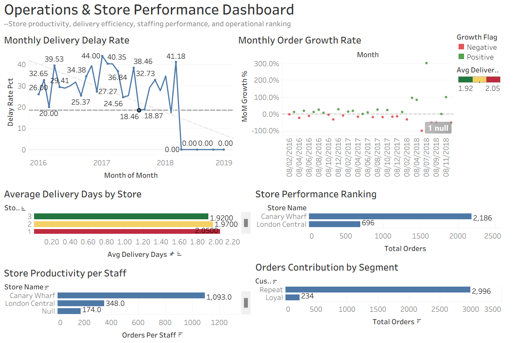

# Cycling Business Analysis | PostgreSQL + Tableau

An end-to-end data analytics project focused on a cycling accessories retail business using **PostgreSQL**, **pgAdmin**, and **Tableau**.

This project transforms raw retail transaction data into business insights through SQL analysis, database modeling, and interactive dashboards.

---

# Project Overview

This project covers the full analytics workflow:

Raw CSV Data → PostgreSQL Tables → SQL Views → Business Analysis Queries → Tableau Dashboards

Business areas analyzed:

- Sales performance
- Monthly growth trends
- Customer behavior
- Store ranking
- Staff productivity
- Delivery efficiency

---

# Tools Used

- PostgreSQL
- pgAdmin 4
- SQL
- Tableau
- GitHub

---

# Repository Structure

```text
cycling-business-analysis-sql-tableau/

│── dashboards/
│   ├── customer-insights-dashboard.png
│   ├── operations-store-performance-dashboard.png
│   └── sales-overview-dashboard.png

│── sql/
│   ├── analysis/
│   ├── table/
│   └── view/

│── tableau/
│   └── cycling_business_dashboard.twbx

│── (raw)datalab_export_2026-04-23 16_36_32.csv

│── README.md

````markdown id="6n1szm"
## Database Structure

### Base Tables

Located in:

```text
sql/table/
````

Files:

* `01_create_customers_table.sql`
* `02_create_orders_raw_table.sql`
* `03_create_staff_table.sql`
* `04_create_store_lookup_table.sql`
* `05_create_stores_table.sql`

These scripts define the relational schema used for analysis.

---

### Analytical Views

Located in:

```text
sql/view/
```

Files:

* `01_create_customer_segments_view.sql`
* `02_create_customer_summary_view.sql`
* `03_create_delivery_performance_view.sql`
* `04_create_monthly_growth_view.sql`
* `05_create_monthly_kpi_view.sql`
* `06_create_store_performance_view.sql`

These views simplify reporting and dashboard creation.

---

## SQL Business Analysis

Located in:

```text
sql/analysis/
```

Included analyses:

* Average Delivery Days
* Delivery Delay Rate
* Late Shipment Rate by Month
* Monthly Growth Rate (Window Function)
* Monthly Order Trend
* Order Status Distribution
* Staff Productivity
* Staff Share of Orders
* Store Performance
* Store Ranking (RANK)

---

## Tableau Dashboards

---

### 1. Executive Sales Overview Dashboard



**Focus:**

- KPI Summary  
- Monthly Orders Trend  
- Month-over-Month Growth  
- Current vs Previous Month Orders  
- Growth Performance  

---

### 2. Customer Insights Dashboard



**Focus:**

- Customer Retention  
- Purchase Frequency  
- Segment Distribution  
- Unique Customers by Store  
- Average Orders by Segment  

---

### 3. Operations & Store Performance Dashboard



**Focus:**

- Delivery Delay Trends  
- Store Ranking  
- Orders Contribution  
- Staff Productivity  
- Average Delivery Days  
---

## Key Insights

### Sales

* Strong growth period followed by a sharp decline in later months.
* Clear monthly volatility and promotional spikes.

### Customers

* Repeat customers dominate the customer base.
* Loyal customers place significantly more orders.

### Stores

* Canary Wharf outperformed London Central in sales volume and customer count.

### Operations

* Delivery efficiency improved over time.
* Delay rate generally trended downward.

---

## Skills Demonstrated

* PostgreSQL Database Design
* SQL Joins
* Aggregations
* Window Functions
* Ranking Functions
* View Creation
* KPI Development
* Customer Segmentation
* Tableau Dashboard Design
* Business Storytelling

---

## How to Use

### Run SQL Scripts

Create tables from:

```text
sql/table/
```

Create views from:

```text
sql/view/
```

Run business queries from:

```text
sql/analysis/
```

---

### Open Tableau Dashboard

Use:

```text
tableau/cycling_business_dashboard.twbx
```

Open in Tableau Public or Tableau Desktop.

---

## About This Project

This project was built as a portfolio project to demonstrate practical **Data Analyst / BI Analyst** skills using real business scenarios with SQL and Tableau.

---

## Author

**Fengzhe Li**
```
